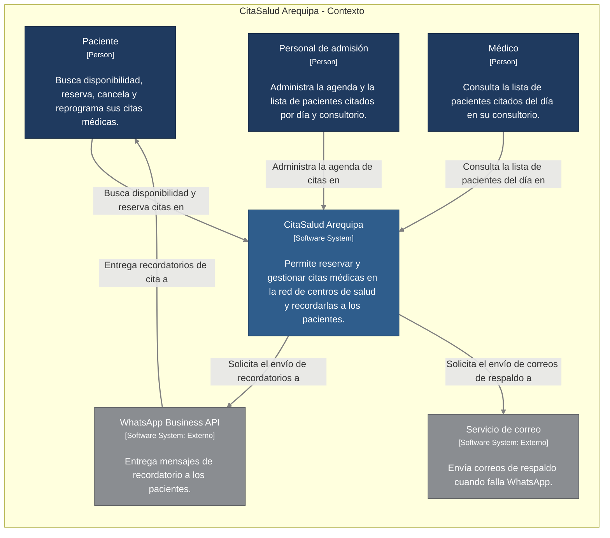

## Arquitectura C4 (Lab 06)

Todas las vistas se generan centralizadamente a partir de una fuente única de verdad:
[workspace.dsl](docs/architecture/c4/workspace.dsl).

### Contexto del sistema

```mermaid
graph LR
  linkStyle default fill:none,stroke:grey,stroke-width:2px,color:none;
  classDef default fill:#ffffff,stroke:#000000,color:#000000;
  classDef factor fill:#1F3A5F,stroke:#152740,color:#ffffff;
  classDef sys fill:#2F5D8C,stroke:#203E5E,color:#ffffff;
  classDef ext fill:#8A8D91,stroke:#5C5E61,color:#ffffff;

  subgraph diagram["CitaSalud Arequipa - Contexto"]
    paciente["Paciente<br/><div style='font-size: 80%'>[Person]</div><br/>Busca disponibilidad, reserva, cancela y reprograma sus citas médicas."]:::factor
    admision["Personal de admisión<br/><div style='font-size: 80%'>[Person]</div><br/>Administra la agenda y la lista de pacientes citados por día y consultorio."]:::factor
    medico["Médico<br/><div style='font-size: 80%'>[Person]</div><br/>Consulta la lista de pacientes citados del día en su consultorio."]:::factor
    citasalud["CitaSalud Arequipa<br/><div style='font-size: 80%'>[Software System]</div><br/>Permite reservar y gestionar citas médicas en la red de centros de salud y recordarlas a los pacientes."]:::sys
    whatsapp["WhatsApp Business API<br/><div style='font-size: 80%'>[Software System: Externo]</div><br/>Entrega mensajes de recordatorio a los pacientes."]:::ext
    correo["Servicio de correo<br/><div style='font-size: 80%'>[Software System: Externo]</div><br/>Envía correos de respaldo cuando falla WhatsApp."]:::ext

    paciente-->|"Busca disponibilidad y reserva citas en"|citasalud
    admision-->|"Administra la agenda de citas en"|citasalud
    medico-->|"Consulta la lista de pacientes del día en"|citasalud
    citasalud-->|"Solicita el envío de recordatorios a"|whatsapp
    citasalud-->|"Solicita el envío de correos de respaldo a"|correo
    whatsapp-->|"Entrega recordatorios de cita a"|paciente
  end
```
